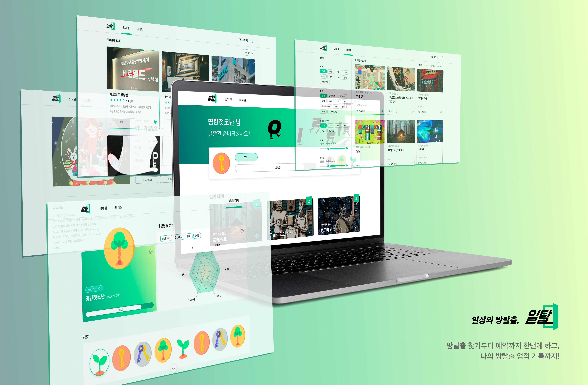

<a name="Top"></a>

# 일상의 방탈출

## 📑 목차

1. [🚪 프로젝트 소개](#-프로젝트-소개)
2. [✨ 주요 기능](#-주요-기능)
3. [💻 라이브러리](#-라이브러리)
4. [📁 디렉토리](#-디렉토리)
5. [🔫 트러블 슈팅](#-트러블-슈팅)
6. [🧑‍🤝‍🧑 팀원 소개 프론트엔드](#-팀원-소개-프론트엔드)
7. [🙏 도움주신분들](#-도움주신분들)

## 🚪 프로젝트 소개

### 일탈 웹사이트 바로가기 [:globe_with_meridians:](https://il-tal.com/)

> 방탈출, 하고는 싶은데 뭘 해야할지 모르겠다면?? :thinking: <br/>
> 일탈에서 방탈출 정보를 한번에 모아보고, 바로 예약사이트로 연결까지 <br/>
> 나의 방탈출 업적을 기록해 뱃지도 받아보세요~

[](https://il-tal.com/)

> 일탈 웹사이트 바로가기

<p align="right">(<a href="#Top">맨 위로</a>)</p>

## ✨ 주요 기능

- 방탈출 업체와 테마의 정보를 한번에 모아볼 수 있어요!
- 원하는 방탈출 테마의 조건으로 검색하고 평점순,리뷰순 등으로 정렬해서 볼 수 있어요!
- 하고 싶은 테마를 찾았다면 예약사이트로 바로 연결할 수 있어요!
- 방탈출을 하고 해당 테마의 리뷰를 남기면 성공횟수와 실패횟수로 뱃지를 획득할 수 있어요!
- 마음에 드는 방탈출 업체와 테마는 찜해두고 마이페이지에서 모아볼 수 있어요!

<p align="right">(<a href="#Top">맨 위로</a>)</p>

## 📁 디렉토리

<details>
  <summary>자세히</summary>

```bash
📦 src
├─ api
├─ asset
│  └─ img
├─ components
│  ├─ company
│  ├─ detailCompany
│  ├─ detailTheme
│  ├─ main
│  │  └─ component
│  ├─ map
│  ├─ modal
│  ├─ mypage
│  │  └─ component
│  ├─ serch
│  ├─ shared
│  └─ theme
├─ header
├─ hooks
├─ page
├─ Router
├─ styles
└─ utils

```

</details>

<p align="right">(<a href="#Top">맨 위로</a>)</p>

## 💻 라이브러리

<!-- React -->

 <!-- Styled-Component -->  <!-- Axios -->  <!--React-Query  -->  <!-- React-Hook-Form --> <!-- date-fns -->  <!-- React-Router-Dom -->  <!-- yup -->  <!-- rc-slider -->  <!-- react-kakao-maps-sdk 1.1.5 -->  <!-- react-icons 4.6.0 -->  <!-- react-js-pagination ^3.0.3 -->  <!-- recharts 2.1.16 -->  <!-- recoil ^0.7.6 -->  <!-- sweetalert2 ^11.6.15 -->  <!-- swiper ^8.4.5 --> 

### 주요 라이브러리 간단소개

  > React Query

  - 많은 이미지 파일을 효과적으로 관리하기 위해서 캐싱 기능이 잘 되어 있는 Query 를 도입하게 되었습니다.

  > Recoil (전역 상태 관리)

  - redux 보다 간단하고, Context API 는 하위 컴포넌트를 리렌더링 하는 문제가 있어 도입했습니다.

  > Recharts

  - chart.js 가 moment.js 라는 라이브러리를 쓴다고 해서 date-fns 를 쓰는 입장에선 다른 가벼운 라이브러리를 선택함.

<p align="right">(<a href="#Top">맨 위로</a>)</p>

## 🔫 트러블 슈팅

### 많은 이미지로 인한 로딩 속도 저하.

- Lighthouse 측정 결과 이미지를 처음에 그리는 속도가 느리다는 것을 깨달음.

- 문제 상황 :
  불러와야 하는 이미지의 크기가 너무 커서 불러오는 속도가 느려짐. Lighthouse 측정으로 이미지 불러오는 시간 약 3s 이상이 소모됨.

- 해결 방법

1. skeleton ui 를 쓴다.
   : 뼈대만 미리 불러오는 방식을 사용해서 First Contentful Paint 시간을 줄일 수 있음.
   사용자들은 처음 로딩에서 아무것도 나오지 않는 것 보다, 로딩 이미지라도 나오면 덜 지루해하고,
   로딩되고 있다는 것을 알기 때문에 아예 나오지 않는 것보다 더 오랜 시간 기다릴 수 있게 됨
   단지 이는 이미지를 빨리 받는 해결책과는 다름.

2. 이미지의 확장자를 Webp로 변경해서 그리기로 함.
   : jpg 나 png 에 비하여 더 작은 용량으로 더 높은 품질의 이미지를 제공하는 이미지라,
   적은 이미지로 큰 화면을 그릴수 있다는것이 장점으로 작용함.
   : 이미지 태그를 Picture 태그를 사용하여 webp 가 지원되지 않는 브라우저에서의 호환성을 생각함.

- 결과
- Lighthouse 측정 결과 이미지 불러오는 속도가 0.97 로 감소.
- AVIF 라는 확장자가 최근에 뜨는 추세라고 하여, 웹 이미지에 대한 최적화에 더 관심을 많이 가져야겠다.

### 로그인 체크

- 로그인 시 유저의 정보를 저장하여 유저 정보가 필요한 부분(마이페이지 등) 에서 사용이 필요함.

- 문제 상황 :
- 처음 로그인을 할 때, 로그인 체크 전역변수를 만들어서 로그인을 하면 true, 로그아웃을 할 때 false가 되도록 만들었다.
- 하지만 부득이한 이유로 페이지를 새로고침 하게 되면 state값이 사라져서 실제로 토큰은 들고 있지만 로그인 체크 변수가 false상태가 되는 문제가 있었다.

- 해결 방안

1. 헤더에 로그인 체크 API를 만들어 전역변수로 관리한다.
: 간편하게 구현되며 직면한 문제도 쉽게 해결될 수 있다고 생각이 들었다. 하지만 방안 2의 경우 굳이 서버와 여러번 통신하지 않아도 문제를 해결할 수 있기 때문에 방안2를 최대한 이용하기로 생각했다.

2. 로그인시 받은 토큰과 유저정보의 유무를 이용하여 관리한다.
: 새로고침 하여도 휘발되지 않는 session storage에 로그인 시 받은 유저 정보와 토큰을 저장하여 useEffect를 통해 session storage에 있는 유저 정보를 받아오고, 유저 정보의 유무에 따라 로그인 체크 전역변수를 한번 더 true나 false로 변경하여 새로고침 하여도 유저 로그인 상태를 구별할 수 있게 되었다.

- 결론 
: SPA을 만들면서 사이트가 새로고침 될 일이 별로 없다고 생각했는데, 실제 웹사이트를 사용 할 유저가 어떻게 사용할지 모르므로 예상되는 다양한 문제점을 미리 많이 고민해봐야 한다는 것을 알게 되었다.

### 좋아요 기능의 느린 반응

- 업체별, 테마별 페이지에 리스트 형태로 있는 각각 업체 or 테마들의 리스트에서 직접 좋아요 기능을 누를 수 있도록 하였다.

- 문제 상황
: 각 회원이 좋아요를 누른 유무는 업체나 테마별 리스트를 불러올 때 response 에 bool 값을 받게 된다.
한 유저가 특정 테마의 좋아요를 누르면 나머지 리스트를 refetch 하고 변화된 해당 컴포넌트의 좋아요의 색상이 바뀌게 되는 방법이다.
이 경우 refetch 하는 동안 약간의 딜레이가 체감된다.

- 해결 방안 
: 유저는 refetch 를 기다릴 필요 없이 버튼을 누름과 동시에 색상이 바뀌어야 기능이 빠르게 작동한다고 인식할 것이다. 
좋아요 색상을 바꾸는 state 를 따로 만들어서 클릭 시 true값이 되도록 useState 를 하나 만들고, List를 불러올때도 해당 state 값을 서버에서 받은 데이터에 따라 setState 해주는 방 식으로 서버의 데이터에도 만족을 하면서 속도도 빨라 보이도록 하였다.

- 결론
: 기능의 성능 자체를 빠르게 만드는 것이 제일 중요하겠지만, 기능 사용에 지장을 주지 않으면서 유저가 더욱 쾌적하게 UX 만족도를 신경써서 사이트를 사용 할 수 있는 방법 또한 있다는 것을 느꼈다.

<p align="right">(<a href="#Top">맨 위로</a>)</p>

## 🧑‍🤝‍🧑 팀원 소개 (프론트엔드)

| 이름         | 깃주소                                  | 담당                            |
| ------------ | --------------------------------------- | ------------------------------- |
| 정영훈(리더) | [:link:](https://github.com/clorose)    | 메인 페이지, 마이 페이지        |
| 김휘린       | [:link:](https://github.com/Hwirin-Kim) | 디테일 테마 페이지, 테마 페이지 |
| 박혜민       | [:link:](https://github.com/hyemin0901) | 업체 페이지, 업체 상세 페이지   |
| 전현주       | [:link:]()                              | UI/UX                           |

<p align="right">(<a href="#Top">맨 위로</a>)</p>

## 🙏 도움주신분들

| 제목                         | 링크                                                        | 내용 요약          |
| ---------------------------- | ----------------------------------------------------------- | ------------------ |
| Query Docs                   | [:link:](https://tanstack.com/query/v4/docs/react/overview) | 전반적인 쿼리 문법 |
| 웹 성능을 위한 이미지 최적화 | [:link:](bit.ly/3Wo9qG1)                                    | 웹 성능에 대한 글  |

<p align="right">(<a href="#Top">맨 위로</a>)</p>
